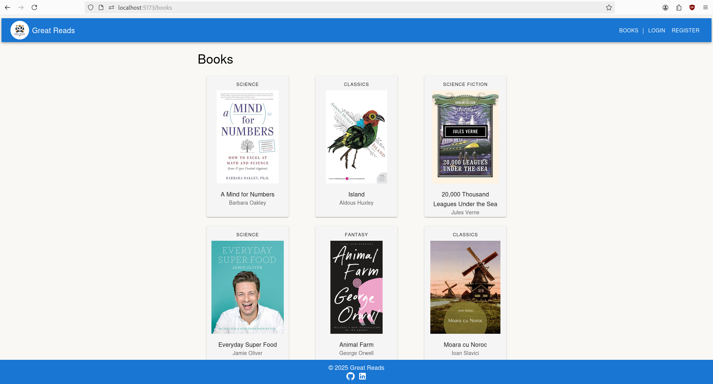
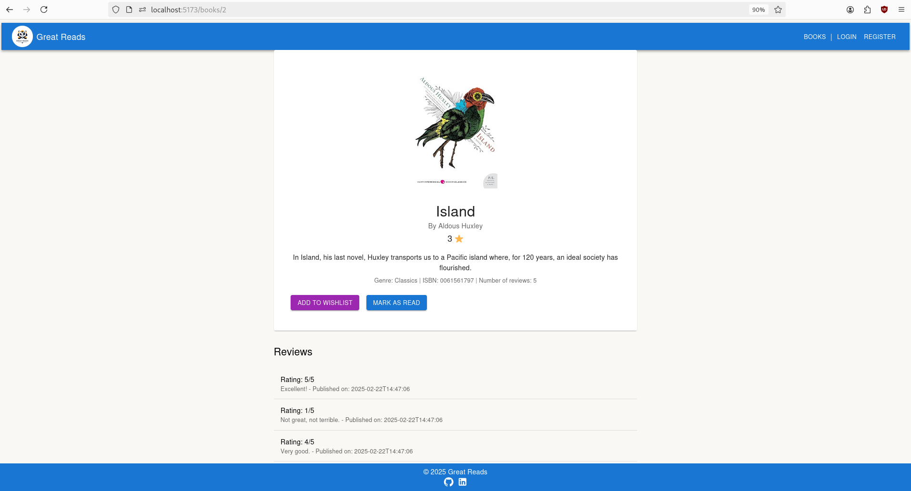

# Great Reads App

## Description
**Great Reads App** is an application inspired by the popular platform [Goodreads](https://www.goodreads.com/), allowing users to manage the books they have read, create wishlists and leave reviews, while authors can publish books and receive feedback from readers.

## Screenshots
### View all books

### View book in detail


## Key Features
- **Authentication and Registration** (implemented with Spring Security and JWT tokens)
- **User Roles:**
  - **Administrator:** manages published books, approves/rejects requests, deletes reviews
  - **Author:** publishes books, views reviews, uploads PDFs
  - **Reader:** adds books to wishlist, marks books as read, leaves reviews
- **Book Management:** filter by genre, add, update, delete books
- **Reviews:** add, edit, delete reviews by readers or administrators
- **Extra Features:** upload avatar, block inappropriate users

## Technologies Used
- **Backend:** Java, Spring Boot, Spring Security, Hibernate, JWT Authentication
- **Database:** MySQL
- **Frontend:** React, Material UI
- **Other Technologies:** REST API, Docker (optional)

## Database Diagram


## API Endpoints
### Administrator Endpoints
| Method | Endpoint | Description |
|--------|---------|-------------|
| PUT | `/administrator/books/{bookId}/approve` | Approve a book |
| PUT | `/administrator/books/{bookId}/reject` | Reject a book |
| DELETE | `/administrator/books/{bookId}/delete` | Delete a book |
| PATCH | `/administrator/books/{bookId}/update` | Update book details |
| PATCH | `/administrator/users/{userId}/block` | Block a user |

### Author Endpoints
| Method | Endpoint | Description |
|--------|---------|-------------|
| POST | `/author` | Add a new book |
| POST | `/author/{bookId}` | Upload book content (PDF) |

### Reader Endpoints
| Method | Endpoint | Description |
|--------|---------|-------------|
| PUT | `/reader/{userId}/books/{bookId}/read` | Mark book as read |
| POST | `/reader/{userId}/books/{bookId}/wishlist` | Add book to wishlist |
| GET | `/reader/{userId}/read` | Get list of read books |
| GET | `/reader/{userId}/wishlist` | Get wishlist books |
| DELETE | `/reader/wishlist/{userId}/{bookId}` | Remove book from wishlist |
| DELETE | `/reader/read/{userId}/{bookId}` | Remove book from read list |

### Book Endpoints
| Method | Endpoint | Description |
|--------|---------|-------------|
| GET | `/books/{bookId}` | Get book details |
| GET | `/books` | Get all books |
| GET | `/books/genre/{genreName}` | Get books by genre |

### Review Endpoints
| Method | Endpoint | Description |
|--------|---------|-------------|
| POST | `/reviews` | Add a new review |
| GET | `/reviews/{reviewId}` | Get review details |
| GET | `/reviews/books/{bookId}` | Get all reviews for a book |
| GET | `/reviews/users/{userId}` | Get all reviews by a user |
| GET | `/reviews/books/{bookId}/rating` | Get book's average rating |
| PATCH | `/reviews/{reviewId}` | Update a review |
| DELETE | `/reviews/{reviewId}` | Delete a review |

### User Endpoints
| Method | Endpoint | Description |
|--------|---------|-------------|
| POST | `/user/login` | User login |
| POST | `/user/register` | User registration |

## Installation & Running
### 1. Clone the Repository
```bash
  git clone https://github.com/AndreiMititelu97/great-reads.git
  cd great-reads
```

### 2. Configure the Backend
- Example `.env` for environment variables:
```bash
DATABASE_URL=jdbc:mysql://localhost:3306/myApp
DATABASE_USERNAME=myUsername
DATABASE_PASSWORD=myPassword
JWT_SECRET=mySecret
```

### 3. Start the Backend
```bash
  mvn clean install
  mvn spring-boot:run
```

### 4. Start the Frontend
```bash
  cd frontend
  npm install
  npm run dev
```

### 5. Access the Application
- **Backend API** runs by default on **http://localhost:8080**.
- **Frontend** runs on **http://localhost:5173**.
